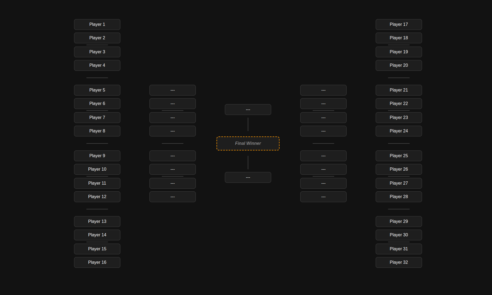
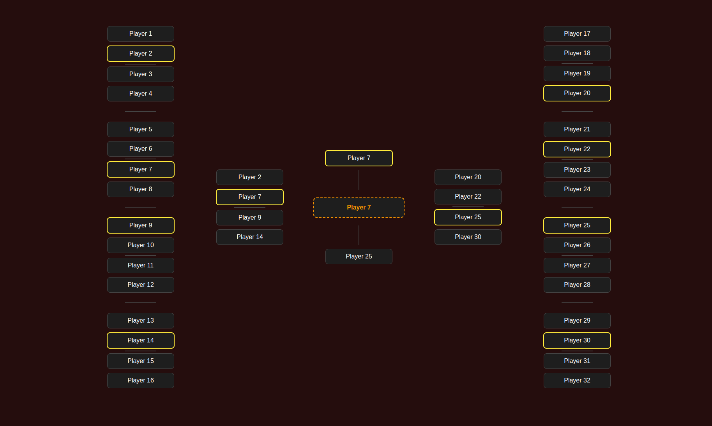
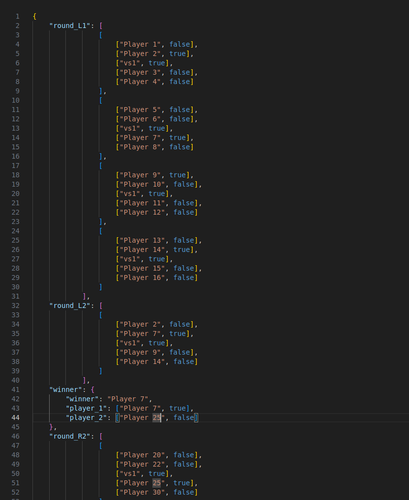

# razor_brackets
App for tourni brackets

- frontend to display the brackets.
    - every 5 sec fetches the json file with the player data
    - reload the brackets
- you make the brackets bigger, smaller, it displays dynamically what is edited in the brackets.json file
- very basic, for internal use only
- no, srsly, I really mean basic. The brackets get populated based on a .json file. And you change the .json file MANUALLY. But it works, so what?

# How
- it is very basic. The flask app runs in debug mode with it own server, but set to listen to 0.0.0.0:5000, so you can run it on a raspberry pi locally, no need for internet access
- there are three .json files in the `/app/static/` directory:
    - `brackets.json` - the main .json that is displayed on the `index` page of the app. You display this one on the screen the plublic looks at
    - `preview.json` - the one you edit and check on the `/preview/` link, to see what you will display on the index. This is just for you
    - `template.json` - this one is for backup. Everytime you start a new tourni, you can use this as a starting point
- basically, you run the page, using whatever (raspberry pi?), then you manually edit the files to display the current score. That is it. Simple, but effective.

# raspberry pi setup
- create a virtual environment for python and install the packages:
- `python3 -m venv razor_brackets_env`
- change the variables in the run script in the `deploy` folder and place it somewhere
- create a systemd file to run it at boot: `sudo vim etc/systemd/system/razor_brackets_server.service`
<pre>
[Unit]
Description=razor_brackets_server
After=network.target

[Service]
ExecStart=/usr/bin/bash /opt/apps/run_razor_brackets.sh
Restart=always
User=pi

[Install]
WantedBy=multi-user.target
</pre>
- and now register and run the server:
- `sudo systemctl enable razor_brackets_server.service`
- `sudo systemctl daemon-reload`
- `sudo systemctl start razor_brackets_server.service`

## kiosk mode
- browser in kiosk mode do not work on pi zero
- gt5 does nto want to install on zero or other raspberries, so my costum FE does not work
- using rpi4 kiosk mode works, but the cursos decided to not give a fuck, and does not want to be hidden or moved in any way.
- fuck this shit.

## podman
- the container runs as the user 1000 inside, but because of the user ID mapping, it will be something else on the local machine
    - this is how you change the mountesd folders accordingly:
    - `podman unshare chown -R 1000:1000 ./data`
