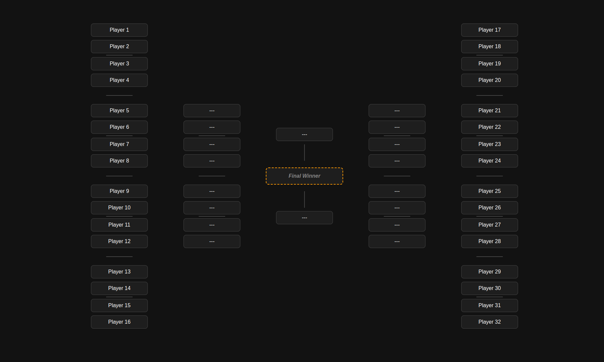
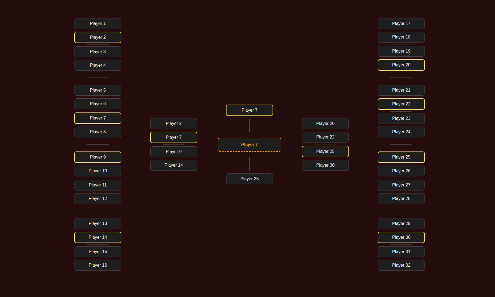
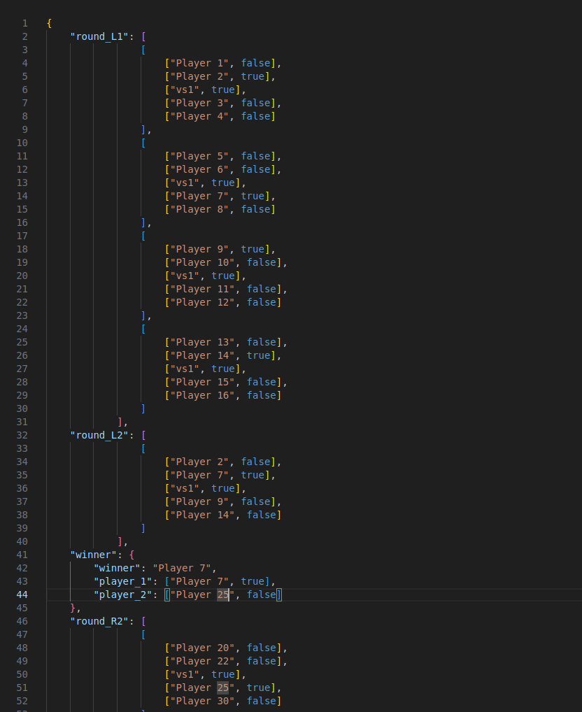

# razor_brackets
App for tourni brackets

- frontend to display the brackets.
    - every 5 sec calls api to check if the json changed
    - if it changed, reload the brackets
- backed where you can edit the json, and preview what you did, before applying the change
- you make the brackets bigger, smaller, it displays dynamically what is edited in the source file
- very basic, for internal use only
- no, srsly, I really mena basic. The brackets get populated based on a .json file. And you change the .json file MANUALLY. But it works, so what?

# How
- it is very basic. The flask app runs in debug mode with it own server, but set to listen to 0.0.0.0:5000, so you can run in on a raspberry pi locally, no need for the internet access
- there are three .json files in the /app/static/ directory:
    - `brackets.json` - the main .json that is displayed on the index page of the app. You display this one in on the screen
    - `preview.json` - the one you edit and check on the `/preview/` link, to see what you will display on the index
    - `template.json` - this one is for backup. Everytime you start a new tourni, you can use this a a starting point
- basically, you run the page, using whatever (raspberry pi?), then you manually edit the files to display the ccurrent score. That is it. Simple, but effective.

